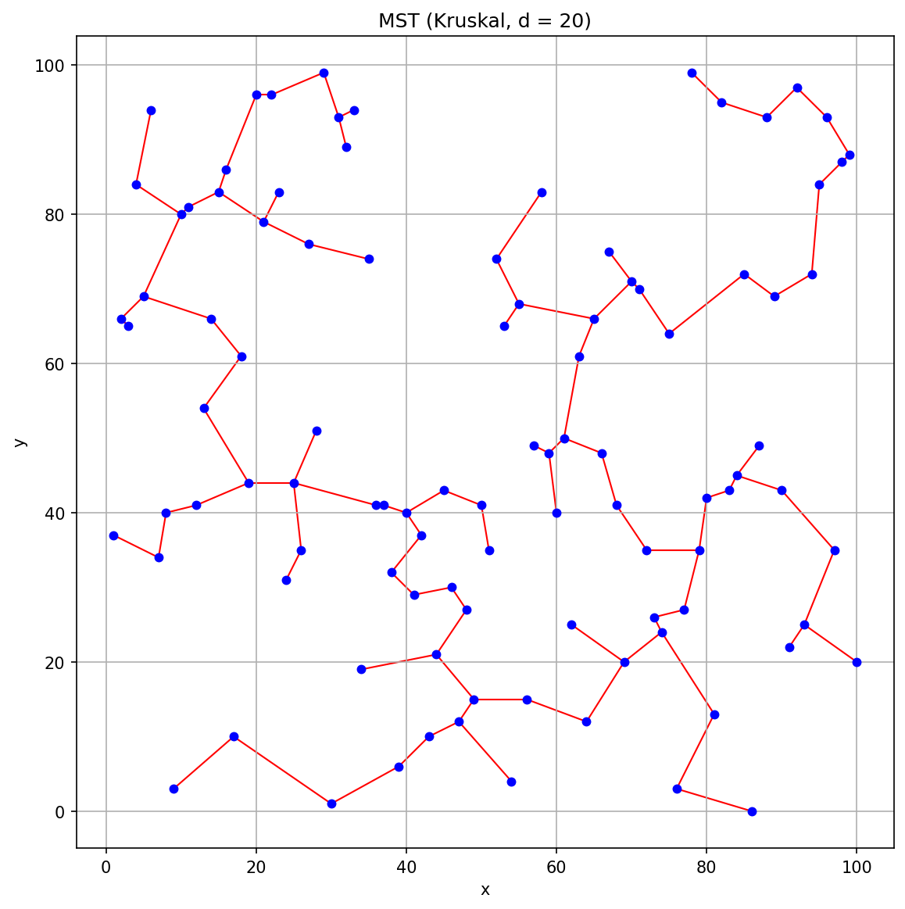

# Minimum Spanning Tree Visualiser

A Python implementation of Kruskal's and Prim's algorithms for computing a minimum spanning tree, built around a validated dataset, a weighted graph constructed from real coordinate data, and SVG/PNG rendering of the results.

## What it does

1. **Validates the input data** — a set of 100 (x, y) points is checked against a published SHA-256 checksum before anything else runs.
2. **Builds `Point` objects** from the validated dataset.
3. **Finds neighbours** of a point within a given distance.
4. **Builds a weighted, undirected graph** by connecting every pair of points within a maximum assignment distance (default 20).
5. **Computes a minimum spanning tree** using either Kruskal's algorithm (sort edges, union-find) or Prim's algorithm (grow outward from a frontier), behind a shared `MSTAlgorithm` interface. By default the two algorithms are cross-checked against each other so a mismatch would be caught immediately.
6. **Renders the result** as SVG (always) and PNG (via matplotlib, if installed) — the raw points, the full graph, and the final MST.

## Project structure

```
main.py                # CLI entry point
mst_project/
  point.py             # immutable Point with distance()
  dataset.py           # dataset + SHA-256 checksum validation
  graph.py             # Edge/Graph, neighbour search, connected components
  mst.py               # DisjointSet, KruskalMST, PrimMST, MSTAlgorithm interface
  rendering.py         # ViewPort, SvgRenderer, MatplotlibRenderer
  application.py       # orchestrates the full pipeline end to end
tests/
  test_requirements.py # pytest suite covering each requirement
conftest.py            # makes mst_project importable for pytest
output/                # sample SVG/PNG output from a run
```

## Running it

```bash
python3 main.py
```

Optional flags:

- `-a, --algorithm {kruskal,prim}` — which MST algorithm to use (default: kruskal)
- `-d, --distance` — maximum distance for connecting two points (default: 20)
- `-o, --output-dir` — where the rendered images are written (default: `output`)
- `-q, --quiet` — suppress the step-by-step narrative
- `--sweep` — report edges/components/MST weight across a range of distances

PNG rendering needs `matplotlib`; SVG rendering has no external dependencies.

## Tests

```bash
python3 -m pytest -v
```

The suite validates the dataset checksum, the distance calculation, neighbour search, graph construction, the cycle property of the computed MST, and that the rendered SVG contains every point and edge — then runs the whole pipeline end to end and checks the numbers it produces.

## Sample output



See the [`output/`](output) directory for the full set of SVG/PNG images produced by a run with the default settings — the raw points, the full graph, and the resulting minimum spanning tree.
